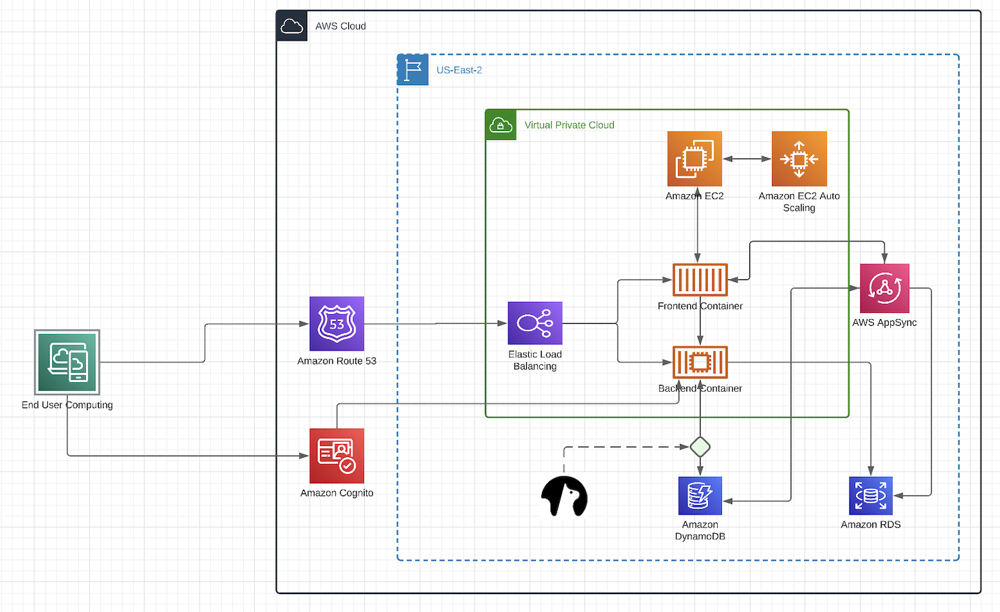
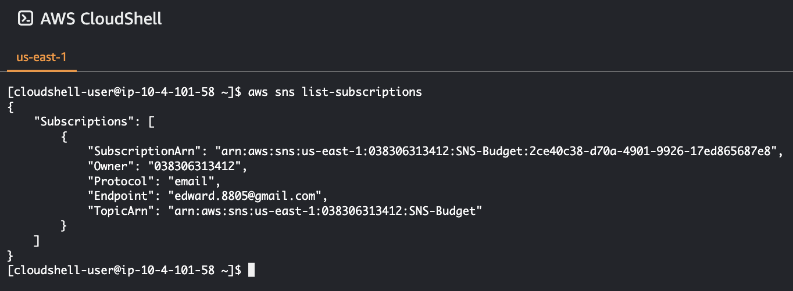
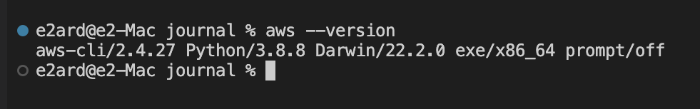
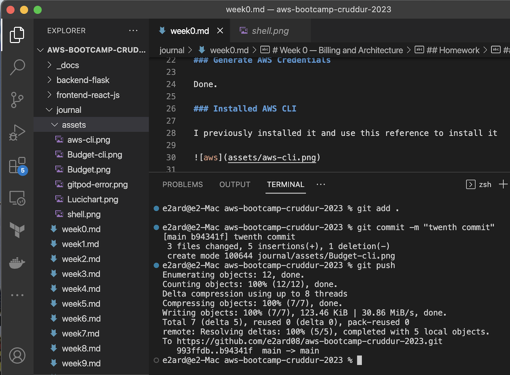
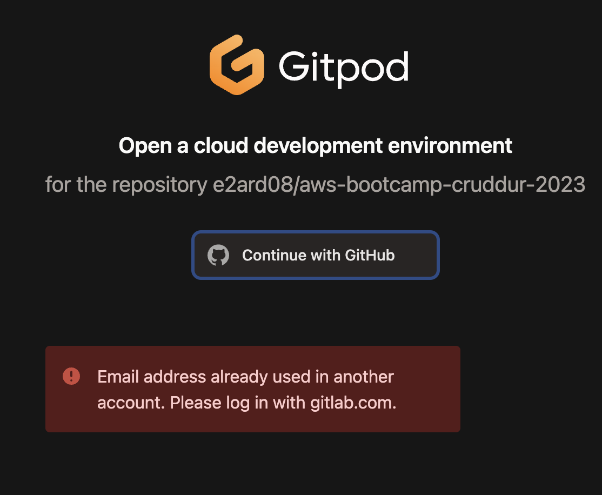
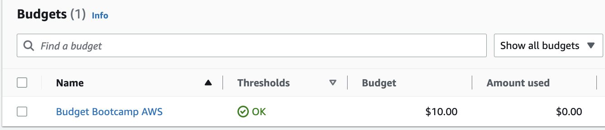
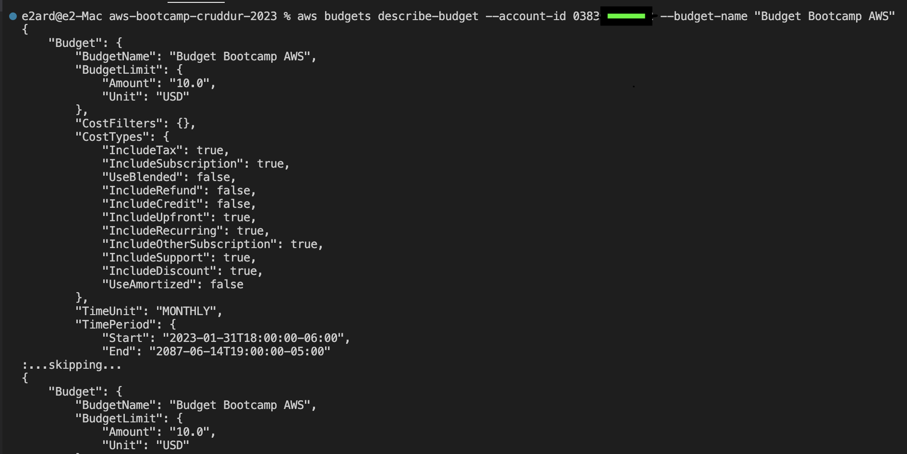

# Week 0 — Billing and Architecture

## Homework


### Architecture in Lucichart

[Check it out !](https://lucid.app/lucidchart/ced94c16-77ec-47c1-abc5-675eac3eb8ef/edit?viewport_loc=-393%2C-204%2C3897%2C1944%2C0_0&invitationId=inv_335dd30a-6d0f-4b6b-b53b-3c6757f8b630). 




### Create an Admin User

Done .

### Use CloudShell



### Generate AWS Credentials

Done. 

### Installed AWS CLI

I previously installed it and use this reference to install it




https://docs.aws.amazon.com/cli/latest/userguide/getting-started-install.html

Step 1 

```
curl "https://awscli.amazonaws.com/AWSCLIV2.pkg" -o "AWSCLIV2.pkg"
```

Step 2 

```
sudo installer -pkg ./AWSCLIV2.pkg -target /
```

Step 3

```
which aws

/usr/local/bin/aws 

aws --version
```


### Gitpod 

I installed the extension .

but for some reason when I try to open Gitpod , in the page show me I already have a email for github .
for this reason I use my local repo with VS code

##VS Code - Github 




GitPod Error !!  
I will try to fix it soon ... 




### Create a Billing Alarm

Created via GUI AWS


### Create a Budget

I create the budget via GUI but i can see the information via CLI with this command.





### Budget AWS CLI

aws budgets describe-budget --account-id XXXXXX --budget-name "Budget Bootcamp AWS"


